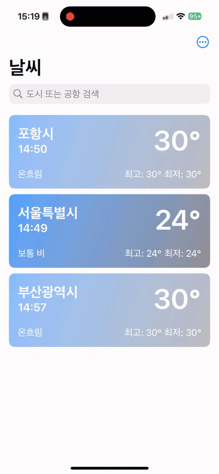
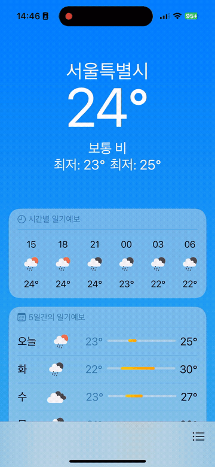

# 🌤️ Weather-TCA

[The Composable Architecture(TCA)](https://github.com/pointfreeco/swift-composable-architecture)를 학습하기 위해 만든 토이 날씨 앱입니다. OpenWeatherMap API로 실제 날씨 데이터를 가져오면서, TCA의 단방향 데이터 흐름과 `@Shared`/`@SharedReader` 상태 공유 패턴을 실습하는 데 초점을 맞췄습니다.

## 스크린샷

<!-- TODO: 아래 경로에 실제 스크린샷 / GIF로 교체 -->
<p align="center">
  
  
  
</p>

## 주요 기능

- 즐겨찾기한 도시들의 현재 날씨를 리스트로 확인
- 도시 이름으로 검색해서 새로운 지역의 날씨를 조회하고 즐겨찾기에 추가
- 시간별(24시간) · 일별(5일간) 상세 예보 확인
- 리스트 항목 → 상세 화면으로의 Zoom Navigation Transition (iOS 18+)
- 앱을 재실행해도 유지되는 즐겨찾기 목록 (`UserDefaults` 기반 영속화)

## 아키텍처

```
Weather_TCAApp
└── RootView (Root)
    ├── SplashView (Splash)   최초 실행 시 도시 목록 로드, 즐겨찾기 도시들의 날씨/예보 fetch
    └── MainView (Main)       즐겨찾기 리스트, 검색, 상세 화면 프레젠테이션
        └── ForecastContentView   시간별 · 일별 예보 UI
```

- **Root**: `Splash → Main` 화면 전환만 담당하는 최상위 리듀서. `Splash`가 로딩을 끝내면 `finishSplash` 액션을 계기로 `Main.State`를 초기화한다.
- **Splash**: 번들에 포함된 도시 목록(`city.list.kr.json`)을 읽고, 즐겨찾기된 도시들(+ 기본값 서울)의 현재 날씨와 예보를 미리 가져와 `Main`에 넘겨준다.
- **Main**: 즐겨찾기 리스트 표시, 검색, 도시 선택 시 날씨/예보 fetch, 즐겨찾기 추가·저장을 담당한다. 리스트 항목을 탭하면 `fullScreenCover` + `matchedTransitionSource`/`navigationTransition(.zoom)`으로 상세 화면으로 전환되고, 검색 결과 선택 시에는 `sheet`로 상세 화면을 띄워 즐겨찾기 추가 여부를 묻는다.
- **Forecast**: 상세 화면 UI(`ForecastContentView`)와 두 가지 프레젠테이션 변형(`ForecastFullScreenView`, `ForecastSheetView`)으로 구성된다.

### 상태 공유

[`swift-sharing`](https://github.com/pointfreeco/swift-sharing)의 `@Shared`/`@SharedReader`로 여러 Feature가 같은 상태를 안전하게 공유한다.

| 키 | 저장 방식 | 쓰는 곳 | 읽는 곳 |
|---|---|---|---|
| `.localities` | 인메모리 | Splash | Main |
| `.bookmarks` | `UserDefaults` (`.appStorage`) | Main | Splash, Main |

## 기술 스택

- **UI**: SwiftUI (iOS 18.5+)
- **아키텍처**: [The Composable Architecture](https://github.com/pointfreeco/swift-composable-architecture)
- **네트워킹**: [Moya](https://github.com/Moya/Moya) (+ Alamofire)
- **날씨 데이터**: [OpenWeatherMap](https://openweathermap.org/) Current Weather / 5 Day · 3 Hour Forecast API
- **테스트**: TCA `TestStore` 기반 단위 테스트

## 프로젝트 구조

```
Weather-TCA/
├── Adapters/            # 외부 I/O를 감싸는 TCA @Dependency (Weather, Locality)
├── Extensions/
├── Features/
│   ├── Root/            # 최상위 화면 전환
│   ├── Splash/          # 초기 로딩 화면
│   ├── Main/            # 즐겨찾기 리스트 + 검색
│   └── Forecast/        # 상세 예보 화면
├── Models/               # Locality, Weather, Forecast (Codable)
├── Networking/           # Moya 기반 네트워크 클라이언트
├── Resources/            # 날씨 아이콘 매핑, 번들 도시 목록 JSON
└── Weather_TCAApp.swift
```

## 시작하기

1. 저장소를 클론한다.
2. [OpenWeatherMap](https://openweathermap.org/api)에서 무료 API 키를 발급받는다.
3. `Weather-TCA/` 폴더에 `Secrets.xcconfig` 파일을 만들고, `OPENWEATHER_API_KEY` 이름으로 키를 채운다.
   ```
   OPENWEATHER_API_KEY = 발급받은_키
   ```
4. Xcode에서 `Weather-TCA.xcodeproj`를 열고 실행한다. Swift Package Manager 의존성은 자동으로 resolve된다.

## 테스트

`Weather-TCATests`에 TCA `TestStore`를 이용한 리듀서 단위 테스트가 포함되어 있다. `⌘U`로 실행한다.

## 배운 점

TCA를 처음 배우면서 만든 토이 프로젝트로, 개발 과정을 블로그 시리즈로 기록하고 있다.

- [SwiftUI + TCA 학습 시리즈](https://velog.io/@jxxnnee/series/SwiftUI-TCA-Study)
